# New World Company Bot

## Table of Contents

- [Overview](#overview)
- [Commands](#commands)
  - [/Submit](#submit)
  - [/Clockin](#clockin)
  - [/Clockout](#clockout)
  - [/Force_ClockOut](#force_clockout)
  - [/Get_User_Time](#get_user_time)
  - [/Adjust_Time_Entry](#adjust_time_entry)
  - [/Get_Time_Range](#gettimerange)
- [Setup](#setup)

## Overview

This Discord bot is designed to provide functionality for New World companies. You can configure it to post VODs of wars for review with build in link validation. The bot also has functionality to allow users to clock in for influence pushes or other activities that would count towards salary or even a points system.

---

## Commands

### /Submit

**Description:**  
Submit a war VOD to the bot. The bot will post it to the preconfigured channel and make a thread for discussion.

**Usage:**  

``` Ruby
/Submit [link] [ign] [town] [war_type] [role] [comments]
```

**Parameters:**

- **Link [Required]**: This should be the link to the replay. The link verification currently support youtube, twitch and insights.gg links.
- **IGN [Required]**: The name of your character in-game for this replay.
- **Town [Required]**: The town you were fighting for.
- **War_Type [Required]**: Was this an Attack or Defence war.
- **Role [Required]**: Your role/class in the war.
- **Comments [Required]**: Any comments you would like to attach to the replay for people reviewing.

**Examples:**

``` Ruby
/Submit link:https://www.youtube.com/watch?v=xvFZjo5PgG0 ign:Sup3rlativ3 town:Everfall war_type:Attack role:Bruiser comments:Need to work on my ability rotation and declumping.
```

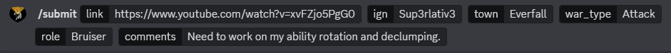

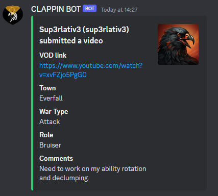

---

### /Clockin

**Description:**  
Starts a timer to track participation in company events. Each user can only be clocked into one event at a time.

**Usage:**  

``` ruby
/Clockin [tag]
```

**Parameters:**

- **Tag [Optional]**: An optional tag to track influence that can be used with other commands such as `/Force_Clockout`.

**Examples:**

``` Ruby
/clockin tag:Everfall
```

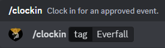

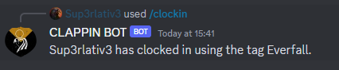

---

### /ClockOut

**Description:**  
Clock out of your current activity.

**Usage:**  

``` Ruby
/clockout
```

**Examples:**

``` Ruby
/clockout
```

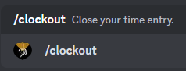

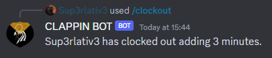

---

### /Force_Clockout

**Description:**  
Forcefully clock everyone out optionally specifying a tag to restrict it to.

**Usage:**  

``` Ruby
/force_clockout [tag]
```

**Parameters:**

- **Tag [Optional]**: Clock everyone out that currently has an open time entry. You can optionally limit who you are clocking out by specifying the same tag the clocked in with.

**Examples:**

``` Ruby
/force_clockout Tag:Everfall
```

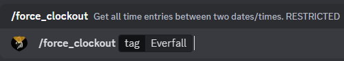

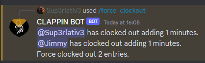

---

### /Get_User_Time

**Description:**  
Get all of the time entries of a specific user.

**Usage:**  

``` Ruby
/get_user_time [User]
```

**Parameters:**

- **User [Required]**: The user you would like to lookup.
- **CSV_Output [Optional]**: If you would like a CSV instead of printing to a message. Useful if there are a lot of entries.

**Examples:**

``` Ruby
/get_user_time user:@Sup3rlativ3 csv_output:False
```

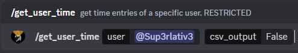

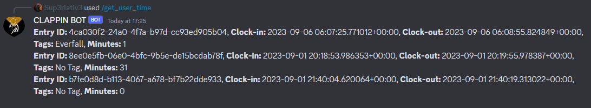

---

### /Adjust_Time_Entry

**Description:**  
Add or remove time from a user's entry. Useful if people forgot to clock in or out of an event.

**Usage:**  

``` Ruby
/adjust_time_entry [tag]
```

**Parameters:**

- **Entry_ID [Required]**: A Required parameter to know which time entry to adjust. You can find this but running the ```/Get_User_Time``` command.
- **Minutes  [Required]**: The amount of minutes you would like to add or remove. If you want to remove minutes from an entry just prefix it with a minus e.g. -30.

**Examples:**

``` Ruby
/adjust_time_entry entry_id: aaaa-bbbb-cccc minutes:30
```

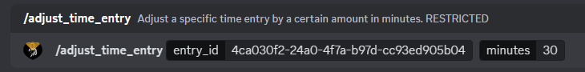

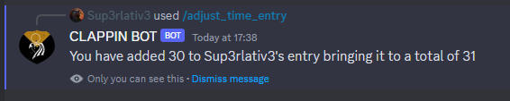

---

### /Get_Time_Range

**Description:**  
Get a list of time entries betwwen two dates.

**Usage:**  

``` Ruby
/get_time_range [start_date] [end_date] [csv_output]
```

**Parameters:**

- **start_date [Required]**: The start date and time you would like to be searching from. The bot should try to figure out different date entry formats such as dd/M/yyyy M/dd/yyyy but the preferred way is yyyy/M/dd.
- **end_date [Required]**: The end date and time you would like to be searching until. The bot should try to figure out different date entry formats such as dd/M/yyyy M/dd/yyyy but the preferred way is yyyy/M/dd.
- **csv_output [Optional]**: If you would like a CSV instead of printing to a message. Useful if there are a lot of entries.

**Examples:**

``` Ruby
/get_time_range start_date: end_date: csv_output:False
```

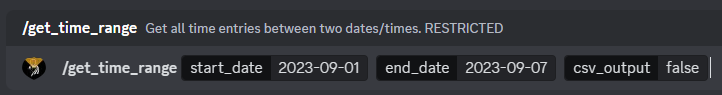

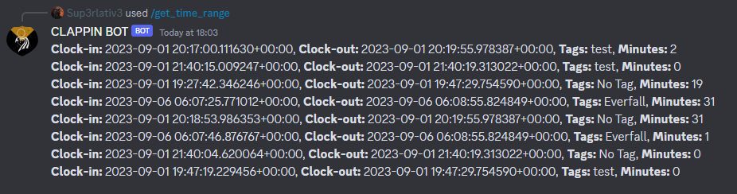

---

## Setup

For setup instructions please look at the [Technical Documation](./docs/Technical.md).